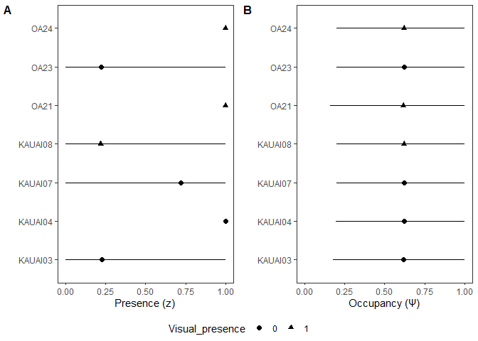
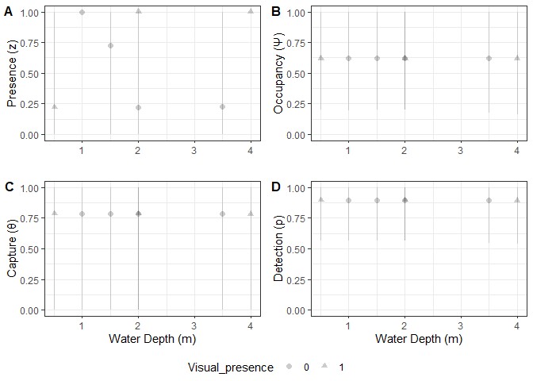

Nuisance Algae Site-Occupancy Detection
================
Patrick Nichols
8/8/2025

# 1. SETUP

Users must set up the number of qPCR technical replicates used
throughout the study (this must be constant across all samples).

Specify which columns of the metadata file will be used as
site-occupancy detection model predictors (habitat covariates).

# 2. IMPORT DATA FILES

To run the analysis, users must have two files:

- **Cq Data** $`\Rightarrow`$ qPCR data with Cq-values as exported from
  the BMS MIC software. Columns must include: -*Well* (corresponds to
  well location in BMS MIC run; numerical 1-48)
  - *Sample* (biological replicate ID, must match metadata file;
    character)
  - *Cq* (calculated per qPCR reaction, “-1” default if no
    amplification; numeric)
  - *Efficiency* (efficiency as calculated by BMS MIC; numeric)
  - *ID* (USER-ADDED COLUMN: continuous and unique identifier for each
    qPCR reaction; character)
- **Sample Metadata** $`\Rightarrow`$ metadata file with the following
  required columns:
  - *Sample* (sample identifier, must match Cq data; character)
  - *Biological_replicate* (codes which biological replicate sample
    belongs to; numerical)
  - *Site* (site location identifier; character)
  - *Sample_type* (must be either “Control” for negative control samples
    or any other character values, such as “Sample” for biological
    samples)
  - *Lat* (site latitude; numeric)
  - *Lon* (site longitude; numeric)
  - *Depth_m* (site depth in meters; numeric)
  - *Visual_presence* (1 if visually observed, 0 or left blank
    otherwise) -Any additional columns of model predictors or metadata
    (as applicable)

# 3. OCCUPANCY MODELING

Site-occupancy detection modeling can be used to estimate:

- **Presence (Z)**: likelihood a site is occupied by target eDNA
- **Occupancy ($`\psi`$)**: probability that eDNA is present as a
  function of habitat covariates at the site level
- **Sample capture ($`\theta`$)**: how likely target eDNA is to make it
  into biological replicates at the field sampling stage
  - **$`\theta_{11}`$**: capture within a sample from a site that is
    occupied (*i.e.*, true positive capture) -**$`\theta_{10}`$**:
    capture within a sample from a site that was not occupied (*i.e.*,
    false-positive inference)
  - **$`1-\theta_{11}`$**: false-negative capture rate
- **Detection ($`p`$)**: how likely technical replicates detect target
  eDNA at the laboratory stage)
  - **$`p_{11}`$**: detection in a technical replicate from a sample
    containing target eDNA (*i.e.*, true positive detection)
  - **$`p_{10}`$**: detection in a technical replicate although not
    present in a sample (*i.e.*, false-positive error)
  - **$`1-p_{11}`$**: false-negative detection rate

## a. Format data for use in R Shiny App

qPCR detection data is changed to the wide format that is compatible
with the R Shiny App for single-species occupancy modeling.

Two files are saved to the working directory:

- *site_occupancy_data_shinyapp.csv* $`\Rightarrow`$ occupancy modeling
  input file to be used with the application
- *site_occupancy_data_sitenames.csv* $`\Rightarrow`$ copy of the
  occupancy input file with site names for reference

## b. Run R Shiny App

Load the file *2site_occupancy_data_shinyapp.csv* into the R Shiny App
**Data** tab.

- Under **Data** tab, assign columns:

  - *Column of confirmed presence* $`\Rightarrow`$ “Visual_presence” (or
    column 3 in the example data)

  - *Column of continuous covariates* $`\Rightarrow`$ “Lat”, “Lon”,
    “Depth_m” (or 4,5,6 in the example data)

  - *Column of categorical covariates* $`\Rightarrow`$ Optional
    categorical covariate column (or 0 in the example data)

  - *Interaction between covariates* $`\Rightarrow`$ Lat:Lon spatial
    interaction (or 4:5 in the example data)

  - *Note:* be sure to check “Header” box to hide column names during
    analysis (otherwise app will crash)

- Under **Settings** tab:

  - Set *Number of Independent eDNA qPCR replicates* to “num.reps” in
    this code (or 3 for the example data)

  - Select which probabilities to estimate: *$`\psi`$, $`\theta_{11}`$,
    $`\theta_{10}`$, $`p_{11}`$, $`p_{10}`$* to estimate all parameters

  - Increase *Number of chains* 1 $`\rightarrow`$ 2

  - Hit *Run*

  - *Note:* increase model iterations if model fails to converge and
    re-run

- Go to **Results** tab: scroll to bottom of the window and *Download*
  output to working directory (save as default filename “output.zip”)

- Close R Shiny App

## c. Load RShiny Data

Unzips RShiny App results into a new folder within the working
directory. The following files are used to plot parameter estimates:

- *download_psi.csv*
- *download_theta11.csv*
- *download_p11.csv*

The remaining files are not used, but can be referenced for remaining
parameter estimates:

- *download_theta10.csv*
- *download_p10.csv*

And habitat covariate predictors:

- *download_beta_psi.csv*
- *download_beta_theta11.csv*
- *download_beta_theta10.csv*
- *download_beta_p11.csv*
- *download_beta_p10.csv*

# 4. Credibility Plots

Results from site-occupancy detection modeling are visualized in the
following plots.

## a. Site Occupancy

Site presence and occupancy as estimated from the model are plotted
side-by-side for each unique site. Presence is fixed (1) if visual
observed marked the target as present, otherwise it is estimated as the
proportion of model iterations where it was estimated to be present.
Occupancy is the inherent probability a site will be occupied, given the
included habitat covariates.

<!-- -->

## b. Habitat covariate: Site Depth

Detection parameters can be specifically plotted against habitat
covariates to visualize their impact on eDNA detections. For the
example, we plot the effect of site depth on presence, occupancy, sample
capture, and detection.

    ## `geom_smooth()` using formula = 'y ~ s(x, bs = "cs")'
    ## `geom_smooth()` using formula = 'y ~ s(x, bs = "cs")'
    ## `geom_smooth()` using formula = 'y ~ s(x, bs = "cs")'
    ## `geom_smooth()` using formula = 'y ~ s(x, bs = "cs")'
    ## `geom_smooth()` using formula = 'y ~ s(x, bs = "cs")'

<!-- -->

# 4. NEGATIVE CONTROLS

Negative control samples are identified and flagged if they produced a
positive qPCR amplification (positive Cq-value). Consider removing
corresponding contaminated samples from the analysis.

    ## [1] "OFB is contaminated. Check the corresponding site!"
